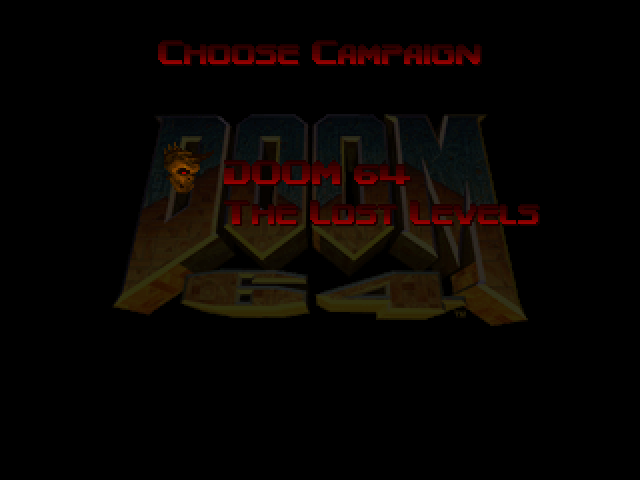
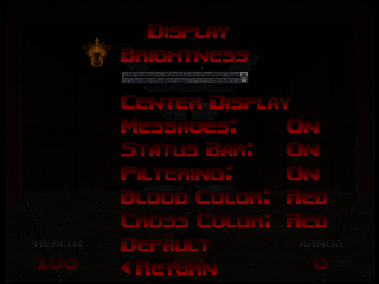
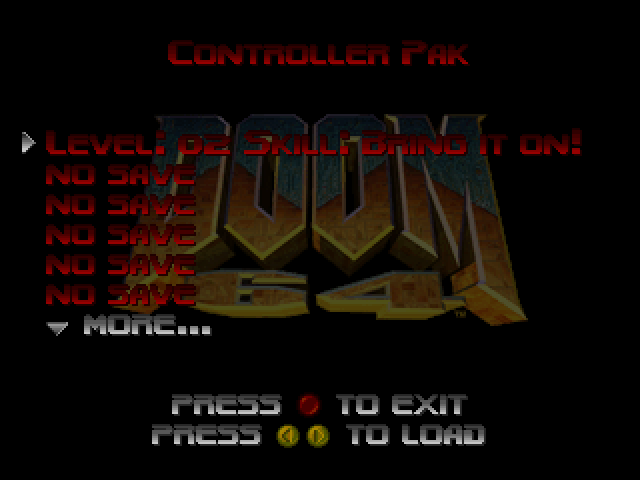
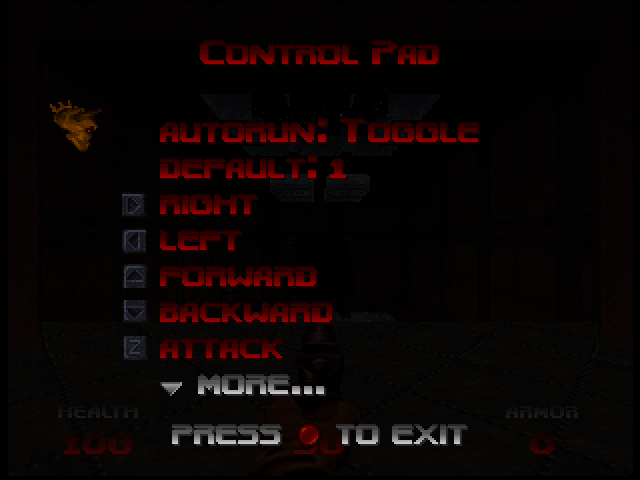
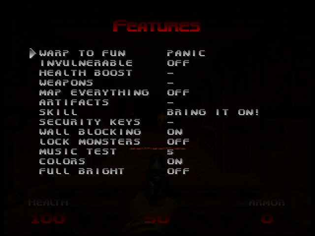
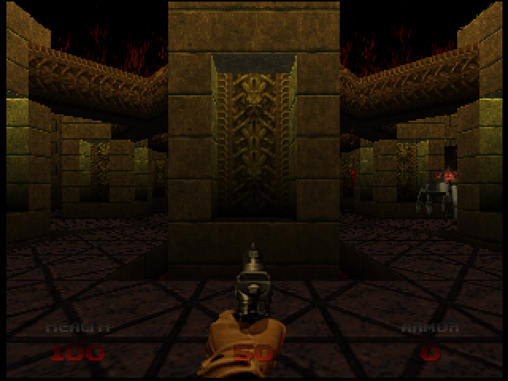
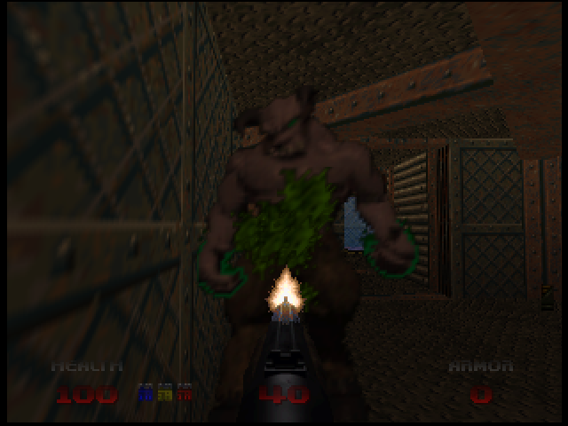
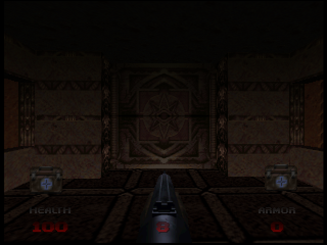

# DOOM 64: Complete Edition

This is the source code for a rom hack based on Erick194's complete reverse engineering of Doom 64: [DOOM64-RE](https://github.com/Erick194/DOOM64-RE/).

The focus of this project is to bring features from Nightdive's 2020 [Doom 64 remaster](https://doomwiki.org/wiki/Doom_64_(2020_version)) into the original game.

## Highlights

- Includes the new levels introduced in the 2020 release (The Lost Levels episode, Panic fun level).
- Option to turn off the three-point texture filter, or filter only skies.
- Option to run automatically when using the D-Pad, or using the "run" button to toggle running.
- Option to toggle green blood from the japanese version.
- Option to toggle medikit, stimpak and berserk sprites with a white cross from the 2020 version.
- Display secret found messages, artifact found messages and regular messages at the same time, with different colors.
- Saved games now include user configuration, including controller bindings.
- Adds an item to the main and game menus to load saved games. The password menu is now only used to enter passwords.
- Restored the unused second medikit pickup message.
- Default brightness is now 100%.
- Compatibility fixes to make maps behave like the 2020 release, aimed to make custom wads compatible[^1]:
  - Support for the Nightmare monster flag.
  - Projectile traps spawn with their radius as their offset.
  - Projectiles immediately explode if they are blocked when they spawn.
  - Action special 123 now raises a platform, instead of being a duplicate of special 121.
  - Passwords can be created for levels 0 and 1.
  - Things with editor numbers higher than 4096 are now allowed.
- No demo desyncs.

In addition, the following extra features were added:

- Restored the third zombie sight and death sounds.
- Adds support for the Expansion Pak for resource intensive maps (thanks [JNMartin](https://github.com/Immorpher/Doom-64-Merciless-Edition/pull/5/files)).
- F3DEX2 rendering microcode (from [Doom 64 Merciless Edition](https://github.com/Immorpher/Doom-64-Merciless-Edition)).
- Adds the fifth difficulty from DOOM64-RE, renamed to Hardcore!
- Includes all extra options from the DOOM64-RE Features menu: Security Keys, Wall Blocking, Lock Monsters, Music Test, Colors and Full Bright.
- Adds extra cheats to the Features menu to give all artifacts and change difficulty.
- Passwords now support up to 128 levels instead of 64 (from [PSXDOOM-RE](https://github.com/Erick194/PSXDOOM-RE)).

[^1]: At the moment it is not know if some these inaccuracies come from the reverse engineered code or the 2020 release.

## Building

### N64 SDK

Download and install the N64 SDK: [N64 Easy Install CD](https://n64.dev/#toolchains). Windows XP is required, so a virtual machine can be used to install it.

Before compiling, the data of the original Doom 64 is required. The Tools folder contains an extractor utility that can be run against the [Doom 64 USA 1.0 ROM](https://datomatic.no-intro.org/index.php?page=show_record&s=24&n=0179). Version 1.1 is not supported. The extractor will produce four files: DOOM64.WAD, DOOM64.WMD, DOOM64.WSD and DOOM64.WDD that have to be copied into the Data folder.

**This rom hack requires resources that are only present in Nightdive's 2020 release.** For this reason, a BPS patch is included in the Data folder (DOOM64.BPS). The Tools folder includes Floating BPS, a tool that can be used to open it. With it, you must patch the DOOM64.WAD found in your 2020 release installation directory (MD5 `0AABA212339C72250F8A53A0A2B6189E`). Then, copy the newly created DOOM64.WAD into the Data folder, replacing the one in the previous step.

Finally, you can run MAKE_ROM.bat to create the ROM.

### iQue

You need to download and install the iQue SDK: https://ultra64.ca/resources/software/

To compile it is required to use Red Hat Linux 9, you can also use virtual machine for such purposes

Once the iQue SDK is installed, copy the "doom64" folder to your home folder.

For now it is compatible with the USA version of Doom 64.

Of course, before compiling you need the data of the original Doom64 (DOOM64.WAD | DOOM64.WMD | DOOM64.WSD | DOOM64.WDD).
To obtain them, go to the Tools folder and compile the Doom64 Extractor (instructions in dm64ex.cpp)
Then extract your rom ``./dm64ex -i baserom.us.z64``
The romname is an example, however it must be in .z64.

Then copy the extracted data to "Data" folder.

Use doom64.bps to patch Nightdive's 2020 release doom64.wad and copy the new wad to the "Data" folder, replacing the extracted one (see [N64 SDK](#n64-sdk) for more detailed instructions).

Then cd to the main doom64 folder and run make:

``make PLATFORM=BB``

Your ROM will be in doom64.n64, and can be ran on your iQue.

## Configuration

In case you are building a custom rom that does not wish to include the Lost Levels maps, you can disable the episode selection UI by going into ``doomdef.h`` and changing ``#define ENABLE_EXTRA_EPISODES 1`` to ``#define ENABLE_EXTRA_EPISODES 0``, provided that you have deleted them from the WAD.

## Notes

Special thanks to Immorpher for the help and ideas.

## Screenshots

